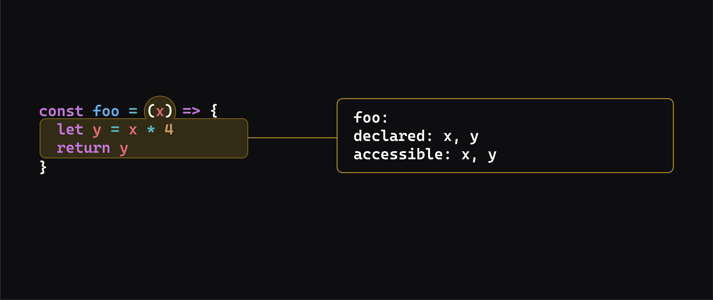

# JavaScript Scope - Concepts

**Learning Objective**: By the end of this lesson, students will be able to define the concept of lexical scope in JavaScript and articulate why scope is crucial for variable management, code readability, and memory efficiency. 

## What is scope?

In general, the concept of [scope](https://developer.mozilla.org/en-US/docs/Glossary/Scope) in programming refers to the variables and functions we can access to from a given line of code.

JavaScript scope is *lexical*, meaning that the code's physical structure determines scope. 

When a line of code doesn't have access to a variable or function, we can describe that variable or function as being "out of scope".

> 📚 In languages with *lexical* scope, such as JavaScript, the accessibility of variables is determined based on their position within code.

## Why does scope matter?

Scope is an essential concept because it determines exactly what variables you can access and where. At first, this may feel limiting, but it has many benefits for us as developers:

- Variable isolation: A variable's use is confined to its scope, making it easier to reduce unintended side effects.
- Code readability: Because a variable is confined to its scope, we can safely reuse the same variable name in different scopes. This can greatly assist readability. For example, if we have multiple loops, we can safely use the `i` variable name in each one.
- Memory efficiency: When a variable is no longer in scope, it can be automatically removed from a computer's memory. We, as developers, don't have to think about or manage this process. This is known as garbage collection and is a benefit in higher-level languages like JavaScript.

## Types of scope in JavaScript

JavaScript has three types of scope:
  - **Global scope**
  - **Function scope**
  - **Block scope**

## Why the different types of scope?

There's a concept in programming known as [the principle of least privilege](https://en.wikipedia.org/wiki/Principle_of_least_privilege). This principle is based on the idea that limiting the accessibility of variables (and functions) helps reduce bugs in the code - think of it as a form of *code safety*.

> 📚 *Code safety* refers to practices that help to prevent or minimize errors, vulnerabilities, and unexpected behavior in a program, ensuring its stability, security, and reliability.
