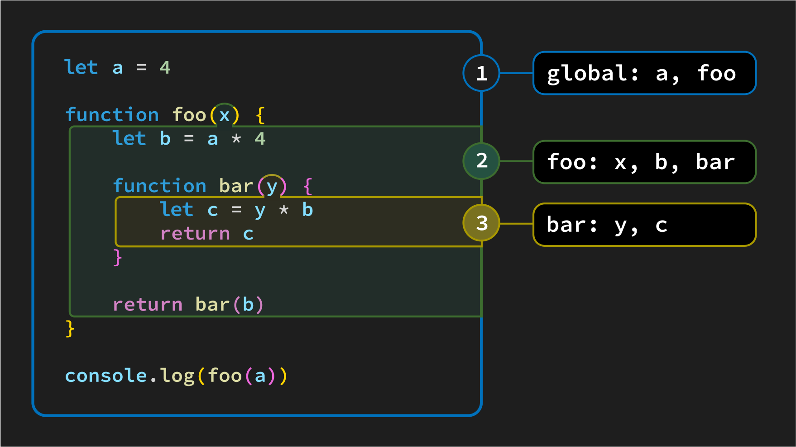

# JavaScript Scope - Types of scope in JavaScript

JavaScript has three types of scope:
  -  **Global scope**
  - **Function scope**, also known as **local scope**
  - **Block scope** courtesy of ES2015’s `let` & `const`

## Why the different types of scope?

There’s a concept in programming known as [the principle of least privilege](https://en.wikipedia.org/wiki/Principle_of_least_privilege). This principle is based on the idea that limiting the accessibility of variables (and functions) helps reduce bugs in the code - think of it as a form of code safety.

*Code safety* refers to practices that help to prevent or minimize errors, vulnerabilities, and unexpected behavior in a program, ensuring its stability, security, and reliability.

## Global scope

JavaScript has a single **global scope**, which can be used to declare variables and functions that need to be accessed from anywhere in the code.  However, it is important to use global variables with caution, as they can be modified by any part of the code, which can lead to unexpected behavior.

Any variable declared outside of a function or block will live in the global scope. In the following example, the variables `size` and `board` are declared in the global scope, so they can be accessed from anywhere in the code, including inside of the `initialize` function.

```js
// main.js

let size, board

function initialize() {
  size = getBoardSize()
  board = generateBoard(size)
  renderBoard()
}

```

## Function (local) scope

When a function is executed, a new scope is created for that function. All variables declared inside the function, regardless of whether they are declared with `var`, `let`, or `const`, are within that function's scope.

Variables in a function's scope only exist while the function is executing, unless the function creates a closure. Closures are a topic for another day.

In this example, the variable `playerName` is declared in function scope, but we can still access the variables `size` and `board`, which are declared in global scope. This is because function scope is a subset of global scope.


```js

function initialize() {
  const playerName = getPlayerName()
  size = getBoardSize()
  board = generateBoard(size, playerName);
  renderBoard()
}

```

A major benefit of having different scopes is that you can use the same variable names in different functions without causing conflicts. If there were only one scope, this would not be possible.

## Block scope

In JavaScript, **block scope** is the scope of a variable declared inside a block of code, such as an `if` block, a `for loop`, or a function body -- in short, anything encased within curly braces `{}`. Variables declared in block scope can only be accessed from within the block of code in which they are declared. 

Both `let` and `const` define variables that can only be accessed within the code block they are defined in.

```js
let isLoggedIn = true

if (isLoggedIn) {
  let username = "Frisco"

  console.log(username) // logs "Frisco"
}

console.log(username) // ReferenceError: username is not defined
```

In the above example, the `username` variable isn't accessible outside of the `if` statement. 


```js
function dinnerMenu() {

  let isHungry = true

  if (isHungry) {
    // Block scope
    let mainDish = "Meatloaf"

    // Function scope gives us access to the hungry variable
    console.log("Hungry?" + "--> " + isHungry) // logs 'Hungry? --> true'

    console.log("Dinner tonight is " + mainDish) // logs 'Dinner tonight is Meatloaf'
  }

  // Outside of the block, the variable is not accessible.
  console.log(mainDish + " is tasty") // ReferenceError: mainDish is not defined
}

dinnerMenu()
```


### Defining variables with `var`

Variables can also be declared with the `var` keyword. `var` is generally less safe and can complicate scope. Its usage is frowned upon so we don't use it in our content and neither should you. If you want to learn more about why you shouldn't use it, check out the `var` Level Up.

## Real world example

Scope is a tough concept, especially when you're new to coding. To help you further understand, here's an real world example to illustrate the concept of scope:

Imagine that you are in a library. The entire library is the **global scope**. You can access anything in the library from anywhere in the library.

Now imagine that you go to the children's section. The children's section is a **local scope**. You can access anything in the children's section from inside the children's section, but you cannot access anything outside of the children's section unless you go outside of the children's section, thereby re-entering **global scope**.

For example, if you want to get a book from the non-fiction section, you have to leave the children's section and go to the non-fiction section.

## Code example of scope

Let’s review. The following diagram demonstrates both global and function scope:


This diagram identifies three different scopes and the identifiers (variables and functions) that live within each scope.

