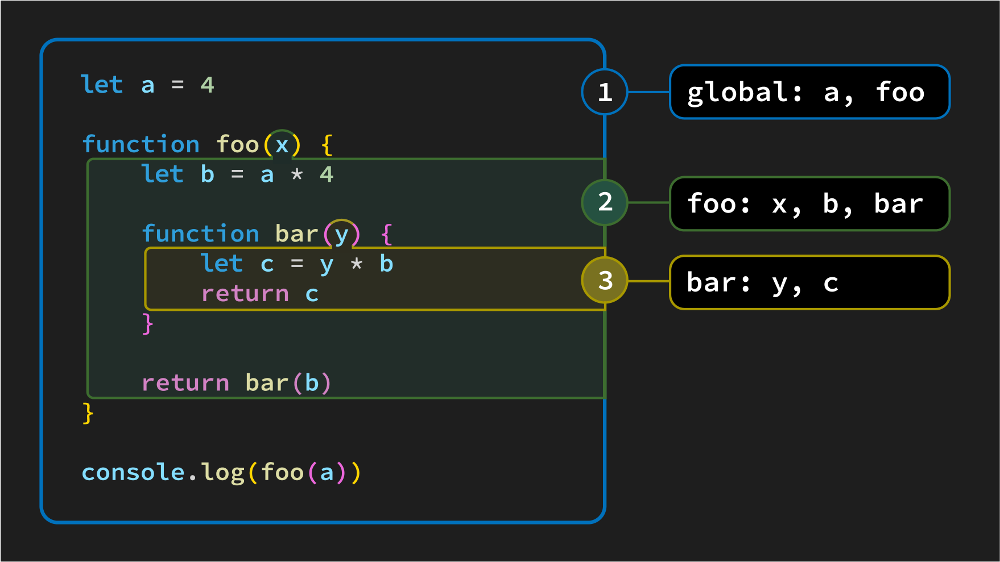

# JavaScript Scope - Types of Scope in JavaScript


JavaScript has three types of scope:
  - **Global scope**
  - **Function scope**
  - **Block scope**

## Why the different types of scope?

There's a concept in programming known as [the principle of least privilege](https://en.wikipedia.org/wiki/Principle_of_least_privilege). This principle is based on the idea that limiting the accessibility of variables (and functions) helps reduce bugs in the code - think of it as a form of *code safety*.

> 📚 *Code safety* refers to practices that help to prevent or minimize errors, vulnerabilities, and unexpected behavior in a program, ensuring its stability, security, and reliability.

## Function scope and block scope

Function scope and block scope behave similarly, so it makes sense to bundle these types of scope when we're thinking about them.

- **Function scope** applies to a variable declared inside a function (including its parameters).

- **Block scope** applies to a variable declared inside a block of code, such as an `if` block or a `for` loop (including any variables defined inside the `( )` of the `for` loop).

Taken together, what this means is that any variable we declare that is encased within curly braces `{ }` can only be used inside of those curly braces.

Here are a couple of examples of this:

```js
const addNums = (numA) => {
  // Inside the addNums function
  const numB = 10;

  console.log(numA + numB);
  // Output: 15
};

addNums(5);

// Outside the addNums function:
console.log(numB);
// ERROR: ReferenceError: numB is not defined
// numB is out of scope!
```

Above, you can see that `numB` isn't available outside the `addNums` function.

> ❓ Is `numA` available outside of the `addNums` function?

```js
let isLoggedIn = true;

if (isLoggedIn) {
  // Defining username inside the if block
  const username = 'Frisco';

  console.log(username); 
  // Output: 'Frisco'
}

// Outside the if block:
console.log(username); 
// ERROR: ReferenceError: username is not defined
```

Here, you can see that `username` isn't available outside the block scope created by the `if` statement.

Let's take a look at an example that combines these two ideas:

```js
const chooseDinner = () => {
  let isHungry = true;
  let mainDish;

  if (isHungry) {
    mainDish = 'meatloaf';
  } else {
    mainDish = 'corn';
  }
  // Note how variables that are part of the outer function scope
  // (created by the function) are available to blocks inside its scope!

  console.log(`Dinner tonight is ${mainDish}`);
  // Output: 'Dinner tonight is Meatloaf'
}

chooseDinner();

// Outside of the function, the variables declared within are unavailable.
console.log(mainDish);
// ERROR: ReferenceError: mainDish is not defined
```

A significant benefit of having different scopes is that we can use the same variable names in different functions without causing conflicts or safety concerns. If there were only one scope, this would not be possible.

So, if these two types of scope are similar, why do we refer to them separately?

First - variables declared with the `var` keyword do not respect block scope. This means that `var` is generally less safe and can complicate scope. Therefore, its usage is frowned upon, so we don't use it in our content, and neither should you when you write code. If you want to learn more about why you shouldn't use it, check out the [`var` Level Up](../level-up/var.md).

Second - variables in a function's scope only exist while the function executes unless the function creates a closure. Closures are a topic not in the scope of this content.

## Global scope

JavaScript has a single **global scope**, which can declare variables and functions accessed from anywhere in the code. Using global variables with caution is essential, as they can be modified by any part of the code, which can lead to unexpected behavior.

Any variable declared outside a function or block will live in the global scope.

Taking our previous example and moving `mainDish` to the global scope allows it to be used anywhere.

```js
let mainDish;

const chooseDinner = () => {
  let isHungry = true;

  if (isHungry) {
    // We are able to modify the global mainDish variable
    mainDish = 'meatloaf';
  } else {
    mainDish = 'corn';
  }
  // Note how variables in the global scope can be modified anywhere!

  console.log(`Dinner tonight is ${mainDish}`);
  // Output: 'Dinner tonight is Meatloaf'
}

chooseDinner();

// Because mainDish was declared in the global scope, it is available.
console.log(mainDish);
// Output: 'meatloaf'
```

## Real-world example

Scope is a tough concept, especially when you're new to coding. To help you further understand, here's a real-world example to illustrate the idea of scope:

Imagine that you are in a library. The entire library is the **global scope**. You can access anything in the library from anywhere in the library.

Now imagine that you go to the children's section. The children's section is a **local scope**. You can access anything in the children's section from inside the children's section, but you cannot access anything outside of the children's section unless you go outside the children's section, thereby re-entering **global scope**.

For example, if you want to get a book from the non-fiction section, you have to leave the children's section and go to the non-fiction section.

## Code example of scope

Let's review. The following diagram demonstrates both global and function scope:



This diagram identifies three different scopes and the identifiers (variables and functions) that live within each scope.
